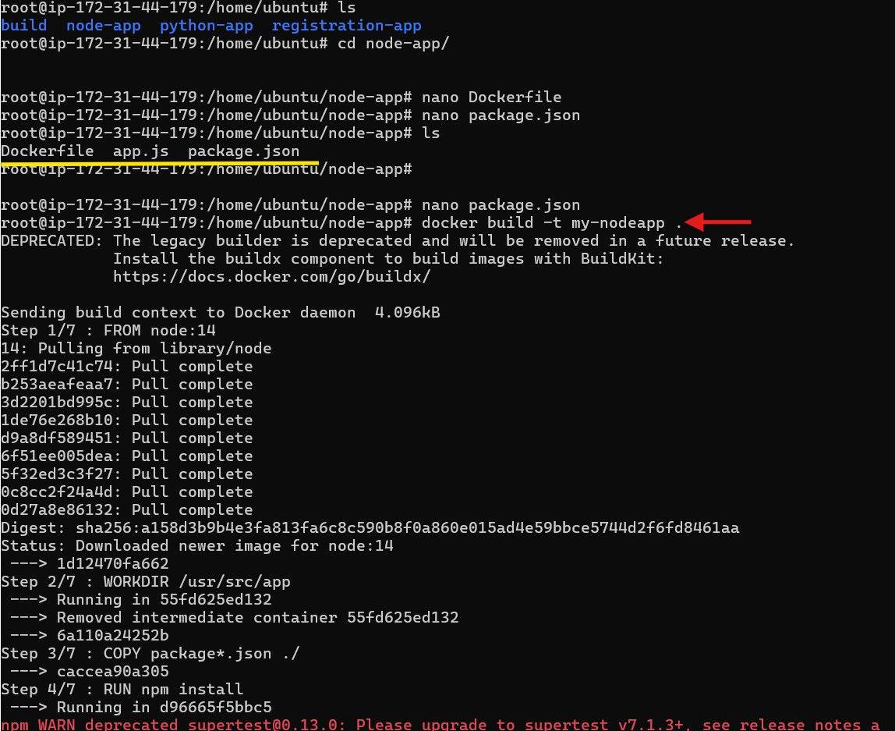
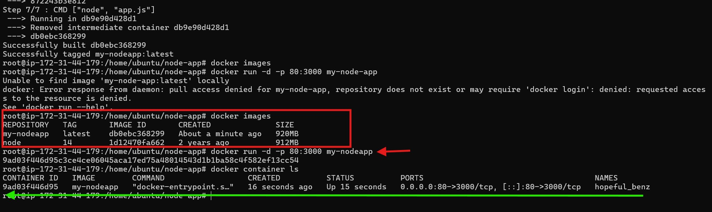
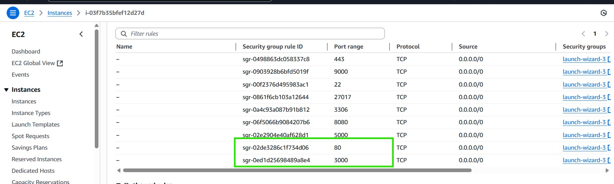
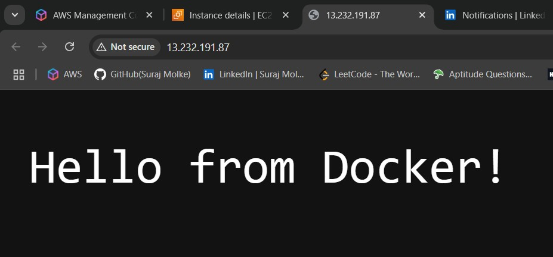

# 📦 Dockerized Node.js App on EC2

This project demonstrates how to run a basic Node.js app in a Docker container on an AWS EC2 instance and access it through a browser.

## 📁 Project Structure

```
node-app/
├── app.js
├── package.json
├── Dockerfile
└── README.md
```

## ✅ Steps Summary

1. **Connect to EC2**
2. **Create Node app** (`app.js`, `package.json`, `Dockerfile`)
3. **Build Docker image**
4. **Run container on port 80:3000**
5. **Allow port 80 and 3000 in EC2 Security Group**
6. **Open `http://<ec2-ip>` in browser**

## 🖼️ Screenshots

### 🔧 Docker Build Output


### 🐳 Container Running Confirmation


### 🔓 EC2 Security Group Settings


### 🔓 Docker Node Output On Browser 

